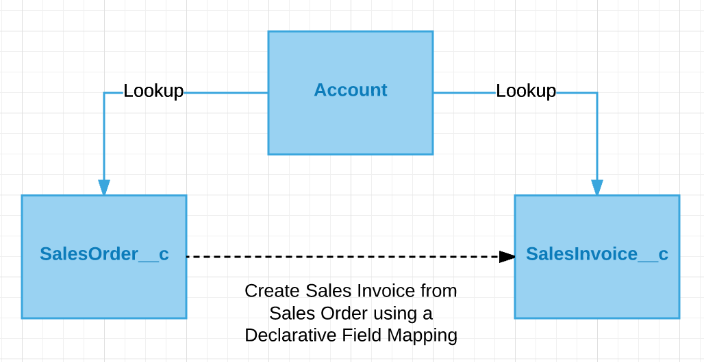
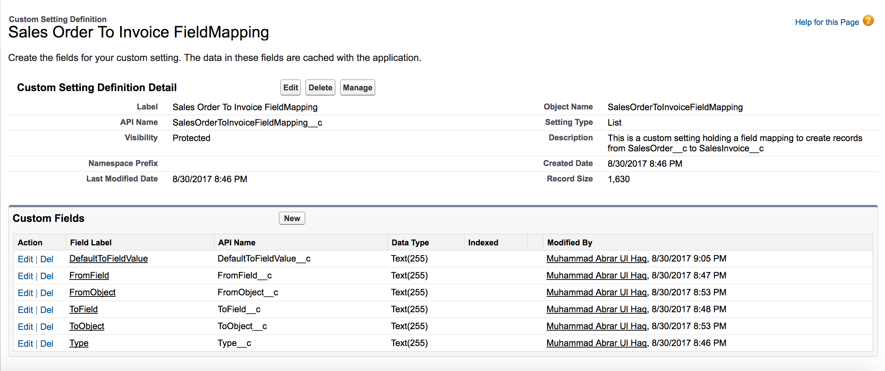
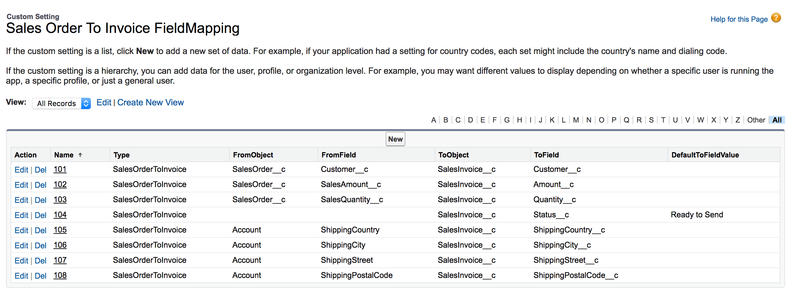
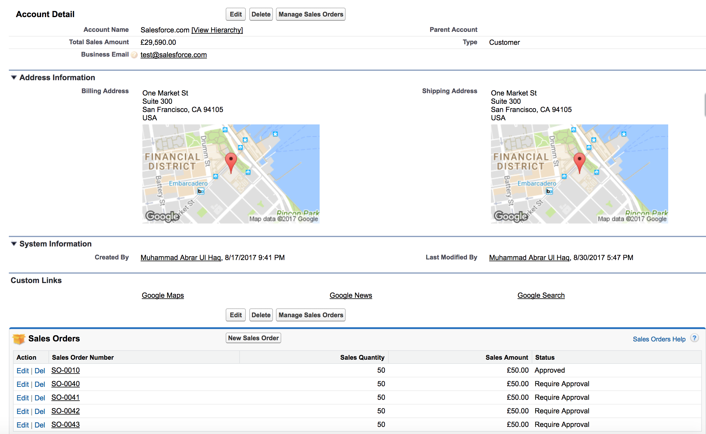
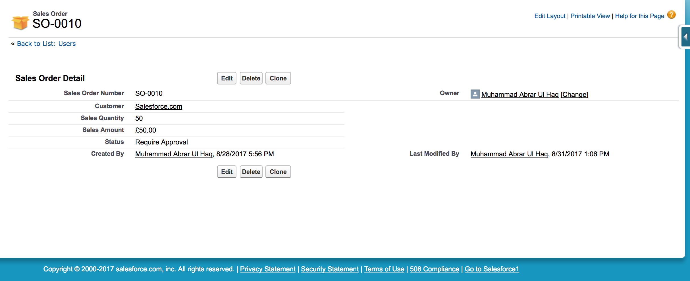
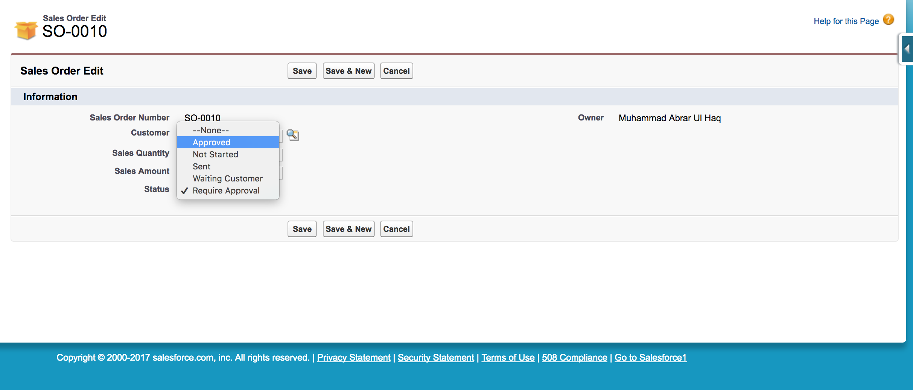
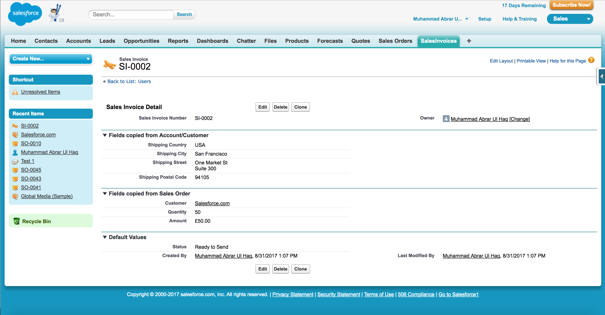

# SFDC-Declarative-FieldMapping

Sometime you get a requirement to create record(s) in "XYZ" object from "ABC" object. During this implementation you would need to have a mapping of "XYZ" object fields. Means how each field of the "XYZ" object will be populated during this creation process.

Usually this kind of functionality requires an Apex trigger on "ABC" object and that executes on particular field update. Developers write the data mapping of each field in the code. If you are a Salesforce Administrator and wants to change the data mapping you would need someone help to dig into code and make a change for you.

What if we have this data mapping option as Declarative feature? Does it possible? Yes it does! Here you would find the code of this recipe/feature.

### Example Considerations
1. Here in this example we have following objects:  
(a) Standard Objects  
-Account  
(b) Custom Objects  
SalesOrder__c  
SalesInvoice__c  
(c) Custom Setting (List Type)  
SalesOrderToInvoiceFieldMapping__c  
(d) Data Model  

2. An after update Apex trigger "SalesOrderTrigger" on SalesOrder__c.  
3. An Apex utility class "SalesInvoiceUtility" to create Sales Invoice records.  
4. The custom setting "SalesOrderToInvoiceFieldMapping__c" contains the data mapping from different Source objects (e.g. Account, SalesOrder__c, Default Values) to SalesInvoice__c objects.  

### Declarative Field Mapping in Action!

